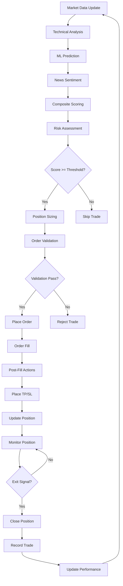
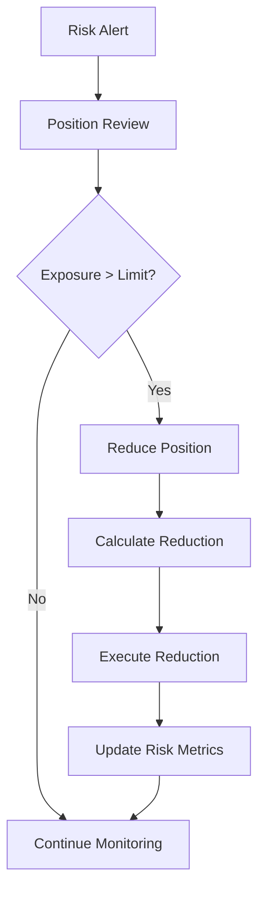
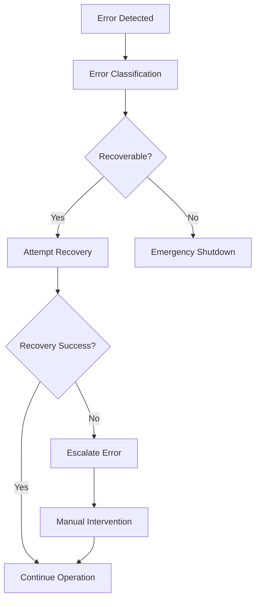

# AiBotBS Agent System Guide

> **Multi-agent orchestration system for intelligent trading decisions**

## 🤖 Agent System Overview

AiBotBS uses a sophisticated multi-agent system where specialized agents collaborate to make trading decisions. Each agent has a specific role and communicates through a structured message protocol, enabling complex workflows while maintaining separation of concerns.

## 🎭 Agent Roles

### 1. **Orchestrator Agent** (Master Coordinator)
**Purpose**: Coordinates all trading activities and makes final decisions

**Responsibilities**:
- Signal generation and evaluation
- Trade execution coordination
- Risk assessment and approval
- Performance monitoring and reporting

**Key Methods**:
```python
async def generate_signal(self, symbol: str) -> Signal
async def evaluate_signal(self, signal: Signal) -> bool
async def execute_trade(self, signal: Signal) -> TradeResult
async def monitor_positions(self) -> List[Position]
```

**State Management**:
- Active signals and their status
- Open positions and orders
- Performance metrics and history
- Risk parameters and limits

### 2. **Technical Analyzer Agent**
**Purpose**: Performs technical analysis and generates TA scores

**Responsibilities**:
- Calculate technical indicators (RSI, MACD, Bollinger Bands, ATR)
- Generate trend analysis and support/resistance levels
- Provide entry and exit timing recommendations
- Monitor market conditions and volatility

**Indicators Supported**:
```python
INDICATORS = {
    'trend': ['sma', 'ema', 'macd', 'adx'],
    'momentum': ['rsi', 'stoch', 'cci', 'williams_r'],
    'volatility': ['bbands', 'atr', 'keltner'],
    'volume': ['obv', 'vwap', 'volume_sma', 'volume_ratio']
}
```

**Scoring Algorithm**:
```python
def calculate_ta_score(self, df: pd.DataFrame) -> float:
    """Calculate composite technical analysis score"""
    scores = {}
    
    # Trend strength (0-1)
    scores['trend'] = self._analyze_trend(df)
    
    # Momentum strength (0-1)
    scores['momentum'] = self._analyze_momentum(df)
    
    # Volatility analysis (0-1)
    scores['volatility'] = self._analyze_volatility(df)
    
    # Volume confirmation (0-1)
    scores['volume'] = self._analyze_volume(df)
    
    # Weighted composite score
    weights = {'trend': 0.3, 'momentum': 0.3, 'volatility': 0.2, 'volume': 0.2}
    composite_score = sum(scores[k] * weights[k] for k in scores)
    
    return min(1.0, max(0.0, composite_score))
```

### 3. **ML Prediction Agent**
**Purpose**: Provides machine learning-based predictions and insights

**Responsibilities**:
- Load and manage ML models
- Generate price predictions and probability estimates
- Identify pattern recognition opportunities
- Provide confidence intervals for predictions

**Model Integration**:
```python
class MLPredictionAgent(BaseAgent):
    def __init__(self, config: Dict[str, Any]):
        self.models = {}
        self.feature_engineers = {}
        self.load_models()
    
    async def predict_price(self, symbol: str, timeframe: str) -> MLPrediction:
        """Generate ML-based price prediction"""
        # Feature engineering
        features = await self._extract_features(symbol, timeframe)
        
        # Model prediction
        prediction = await self._run_prediction(features)
        
        # Confidence calculation
        confidence = self._calculate_confidence(prediction)
        
        return MLPrediction(
            symbol=symbol,
            predicted_price=prediction.price,
            confidence=confidence,
            timeframe=timeframe,
            timestamp=datetime.now()
        )
```

### 4. **News Sentiment Agent**
**Purpose**: Analyzes news and social media for sentiment insights

**Responsibilities**:
- Fetch news from multiple sources
- Analyze sentiment using GPT integration
- Identify market-moving events
- Provide sentiment scores and commentary

**Sentiment Analysis**:
```python
class NewsSentimentAgent(BaseAgent):
    async def analyze_sentiment(self, symbol: str) -> SentimentAnalysis:
        """Analyze news sentiment for a symbol"""
        
        # Fetch recent news
        news_items = await self._fetch_news(symbol)
        
        # GPT sentiment analysis
        sentiment_scores = []
        commentaries = []
        
        for news in news_items[:10]:  # Top 10 most relevant
            sentiment = await self._gpt_sentiment_analysis(news)
            sentiment_scores.append(sentiment.score)
            commentaries.append(sentiment.commentary)
        
        # Aggregate sentiment
        avg_sentiment = sum(sentiment_scores) / len(sentiment_scores)
        
        return SentimentAnalysis(
            symbol=symbol,
            sentiment_score=avg_sentiment,
            news_count=len(news_items),
            top_commentary=commentaries[:3],
            timestamp=datetime.now()
        )
```

### 5. **Execution Agent**
**Purpose**: Handles order execution and position management

**Responsibilities**:
- Place and manage orders
- Handle order fills and updates
- Manage position lifecycle
- Implement risk controls

**Execution Flow**:
```python
class ExecutionAgent(BaseAgent):
    async def execute_trade(self, signal: Signal) -> TradeResult:
        """Execute a trading signal"""
        
        # Pre-execution validation
        validation = await self._validate_signal(signal)
        if not validation.is_valid:
            return TradeResult.failed(validation.reason)
        
        # Risk check
        risk_check = await self._check_risk_limits(signal)
        if not risk_check.passed:
            return TradeResult.failed(f"Risk limit exceeded: {risk_check.reason}")
        
        # Order placement
        order = await self._place_order(signal)
        if not order.success:
            return TradeResult.failed(f"Order placement failed: {order.error}")
        
        # Post-execution actions
        await self._handle_order_fill(order)
        
        return TradeResult.success(order.order_id, order.filled_price)
```

### 6. **Risk Management Agent**
**Purpose**: Monitors and enforces risk parameters

**Responsibilities**:
- Calculate position sizing
- Monitor correlation and exposure
- Enforce risk limits
- Provide risk alerts

**Risk Calculations**:
```python
class RiskManagementAgent(BaseAgent):
    async def calculate_position_size(self, signal: Signal, account: Account) -> float:
        """Calculate safe position size based on risk parameters"""
        
        # Account risk capacity
        max_risk_per_trade = account.equity * self.config.max_risk_per_trade
        
        # Signal confidence adjustment
        confidence_multiplier = signal.composite_score
        
        # Volatility adjustment
        volatility = await self._get_symbol_volatility(signal.symbol)
        volatility_multiplier = 1.0 / (1.0 + volatility)
        
        # Position size calculation
        base_size = max_risk_per_trade * confidence_multiplier * volatility_multiplier
        
        # Apply limits
        max_size = account.equity * self.config.max_position_size
        min_size = self.config.min_position_size
        
        return max(min_size, min(base_size, max_size))
    
    async def check_correlation_risk(self, new_position: Position) -> RiskCheck:
        """Check correlation risk with existing positions"""
        
        existing_positions = await self._get_active_positions()
        
        for pos in existing_positions:
            correlation = await self._calculate_correlation(new_position.symbol, pos.symbol)
            
            if correlation > self.config.max_correlation:
                return RiskCheck.failed(f"High correlation ({correlation:.2f}) with {pos.symbol}")
        
        return RiskCheck.passed()
```

## 📨 Message Protocol

### Message Structure

```python
@dataclass
class Message:
    id: str                           # Unique message identifier
    type: MessageType                 # Message type (TASK, RESPONSE, EVENT)
    from_agent: str                   # Sending agent identifier
    to_agent: str                     # Receiving agent identifier
    subject: str                      # Message subject/action
    content: Dict[str, Any]           # Message payload
    timestamp: datetime               # Message creation time
    priority: Priority = Priority.NORMAL  # Message priority
    correlation_id: Optional[str] = None  # For request-response correlation
    retry_count: int = 0              # Retry attempt counter
    expires_at: Optional[datetime] = None  # Message expiration time
```

### Message Types

```python
class MessageType(Enum):
    TASK = "task"           # Request for action
    RESPONSE = "response"    # Response to request
    EVENT = "event"         # System event notification
    HEARTBEAT = "heartbeat" # Health check message
    BROADCAST = "broadcast" # Broadcast to all agents
    PRIORITY = "priority"   # High-priority message
```

### Priority Levels

```python
class Priority(Enum):
    LOW = 1        # Background tasks
    NORMAL = 2     # Standard operations
    HIGH = 3       # Important operations
    URGENT = 4     # Critical operations
    EMERGENCY = 5  # System-critical operations
```

### Message Routing

```python
class MessageRouter:
    """Routes messages between agents"""
    
    async def route_message(self, message: Message) -> bool:
        """Route a message to its destination"""
        
        # Validate message
        if not self._validate_message(message):
            return False
        
        # Check if destination agent exists
        if not self._agent_exists(message.to_agent):
            return False
        
        # Apply routing rules
        if message.type == MessageType.BROADCAST:
            return await self._broadcast_message(message)
        else:
            return await self._send_to_agent(message)
    
    async def _send_to_agent(self, message: Message) -> bool:
        """Send message to specific agent"""
        try:
            agent = self.agent_registry.get_agent(message.to_agent)
            await agent.handle_message(message)
            return True
        except Exception as e:
            self.logger.error(f"Failed to send message to {message.to_agent}: {e}")
            return False
```

## 🔄 Task Graph System

### Default Trading Workflow



### Alternative Workflows

#### 1. **Risk Management Workflow**


#### 2. **Error Recovery Workflow**


### Workflow Configuration

```yaml
# configs/workflows.yaml
workflows:
  default_trading:
    name: "Default Trading Workflow"
    description: "Standard trading decision and execution flow"
    steps:
      - id: "market_analysis"
        agent: "technical_analyzer"
        action: "analyze_market"
        timeout: 30
        retries: 3
        
      - id: "ml_prediction"
        agent: "ml_agent"
        action: "predict_price"
        timeout: 45
        retries: 2
        
      - id: "news_sentiment"
        agent: "news_agent"
        action: "analyze_sentiment"
        timeout: 60
        retries: 2
        
      - id: "composite_scoring"
        agent: "orchestrator"
        action: "compose_score"
        timeout: 10
        retries: 1
        
      - id: "risk_assessment"
        agent: "risk_agent"
        action: "assess_risk"
        timeout: 20
        retries: 2
        
      - id: "execution_decision"
        agent: "orchestrator"
        action: "make_decision"
        timeout: 15
        retries: 1
        
      - id: "trade_execution"
        agent: "execution_agent"
        action: "execute_trade"
        timeout: 120
        retries: 3
        conditional: "decision.approved"
        
      - id: "position_management"
        agent: "execution_agent"
        action: "manage_position"
        timeout: 300
        retries: 1
        conditional: "trade.success"
```

## 🎛️ Policy Toggles

### Trading Policy Configuration

```yaml
# configs/policy.yaml
trading:
  enabled: true
  mode: "live"  # live, paper, dry_run
  
  risk:
    max_position_size: 0.1      # 10% of portfolio
    max_daily_loss: 0.05        # 5% daily loss limit
    max_correlation: 0.7        # Maximum correlation between positions
    max_drawdown: 0.15          # Maximum drawdown before stopping
    
  execution:
    min_score_threshold: 0.7    # Minimum composite score for execution
    max_slippage: 0.002         # Maximum allowed slippage (0.2%)
    retry_attempts: 3           # Number of retry attempts
    timeout_seconds: 30         # Order timeout
    
  scoring:
    ta_weight: 0.4              # Technical analysis weight
    ml_weight: 0.4              # Machine learning weight
    news_weight: 0.2            # News sentiment weight
    
  safety:
    circuit_breaker_enabled: true
    emergency_stop_threshold: 0.25  # 25% loss triggers emergency stop
    max_concurrent_trades: 5
    cooldown_period_minutes: 30
```

### Agent Policy Configuration

```yaml
# configs/agent_policy.yaml
agents:
  orchestrator:
    enabled: true
    max_concurrent_tasks: 10
    task_timeout_seconds: 300
    retry_policy:
      max_retries: 3
      backoff_multiplier: 2.0
      max_backoff_seconds: 60
  
  technical_analyzer:
    enabled: true
    indicators_enabled:
      - rsi, macd, bollinger_bands, atr
    update_frequency_seconds: 60
    lookback_periods: 100
    
  ml_agent:
    enabled: true
    models_enabled:
      - price_prediction
      - pattern_recognition
    confidence_threshold: 0.6
    update_frequency_seconds: 300
    
  news_agent:
    enabled: true
    sources_enabled:
      - crypto_news
      - social_media
      - economic_calendar
    sentiment_threshold: 0.3
    update_frequency_seconds: 180
    
  execution_agent:
    enabled: true
    max_order_size_usd: 10000
    order_timeout_seconds: 120
    retry_policy:
      max_retries: 3
      backoff_seconds: 5
      
  risk_agent:
    enabled: true
    risk_checks_enabled:
      - position_sizing
      - correlation_analysis
      - drawdown_monitoring
    alert_thresholds:
      high_risk: 0.8
      medium_risk: 0.6
      low_risk: 0.3
```

## 🔧 Agent Lifecycle Management

### Agent States

```python
class AgentState(Enum):
    INITIALIZING = "initializing"
    READY = "ready"
    BUSY = "busy"
    ERROR = "error"
    SHUTDOWN = "shutdown"
    RECOVERING = "recovering"
```

### Agent Health Monitoring

```python
class AgentHealthMonitor:
    """Monitors agent health and performance"""
    
    async def check_agent_health(self, agent_id: str) -> HealthStatus:
        """Check the health of a specific agent"""
        
        agent = self.agent_registry.get_agent(agent_id)
        
        # Response time check
        response_time = await self._measure_response_time(agent)
        
        # Memory usage check
        memory_usage = await self._get_memory_usage(agent)
        
        # Error rate check
        error_rate = await self._get_error_rate(agent)
        
        # Overall health score
        health_score = self._calculate_health_score(
            response_time, memory_usage, error_rate
        )
        
        return HealthStatus(
            agent_id=agent_id,
            status=agent.state,
            health_score=health_score,
            response_time=response_time,
            memory_usage=memory_usage,
            error_rate=error_rate,
            last_check=datetime.now()
        )
```

### Agent Recovery

```python
class AgentRecoveryManager:
    """Manages agent recovery and failover"""
    
    async def recover_agent(self, agent_id: str) -> bool:
        """Attempt to recover a failed agent"""
        
        try:
            agent = self.agent_registry.get_agent(agent_id)
            
            # Attempt restart
            await agent.restart()
            
            # Verify recovery
            health_check = await self.health_monitor.check_agent_health(agent_id)
            
            if health_check.status == AgentState.READY:
                self.logger.info(f"Agent {agent_id} recovered successfully")
                return True
            else:
                self.logger.warning(f"Agent {agent_id} recovery failed")
                return False
                
        except Exception as e:
            self.logger.error(f"Error recovering agent {agent_id}: {e}")
            return False
    
    async def failover_agent(self, agent_id: str) -> bool:
        """Failover to backup agent if available"""
        
        backup_agent = self._get_backup_agent(agent_id)
        if not backup_agent:
            return False
        
        try:
            # Transfer workload to backup
            await self._transfer_workload(agent_id, backup_agent.id)
            
            # Update routing
            self.message_router.update_routing(agent_id, backup_agent.id)
            
            self.logger.info(f"Failover completed for agent {agent_id}")
            return True
            
        except Exception as e:
            self.logger.error(f"Failover failed for agent {agent_id}: {e}")
            return False
```

## 📊 Performance Monitoring

### Agent Metrics

```python
class AgentMetrics:
    """Tracks agent performance metrics"""
    
    def __init__(self):
        self.message_count = 0
        self.response_times = []
        self.error_count = 0
        self.success_count = 0
        self.last_reset = datetime.now()
    
    def record_message(self, response_time: float, success: bool):
        """Record message processing metrics"""
        self.message_count += 1
        self.response_times.append(response_time)
        
        if success:
            self.success_count += 1
        else:
            self.error_count += 1
    
    def get_success_rate(self) -> float:
        """Calculate success rate"""
        if self.message_count == 0:
            return 0.0
        return self.success_count / self.message_count
    
    def get_avg_response_time(self) -> float:
        """Calculate average response time"""
        if not self.response_times:
            return 0.0
        return sum(self.response_times) / len(self.response_times)
    
    def reset_metrics(self):
        """Reset metrics for new period"""
        self.message_count = 0
        self.response_times = []
        self.error_count = 0
        self.success_count = 0
        self.last_reset = datetime.now()
```

### System Performance Dashboard

```python
class PerformanceDashboard:
    """Real-time performance monitoring dashboard"""
    
    async def get_system_overview(self) -> SystemOverview:
        """Get overall system performance overview"""
        
        agents = self.agent_registry.get_all_agents()
        
        total_messages = sum(agent.metrics.message_count for agent in agents)
        total_errors = sum(agent.metrics.error_count for agent in agents)
        avg_response_time = self._calculate_system_avg_response_time(agents)
        
        return SystemOverview(
            total_agents=len(agents),
            active_agents=len([a for a in agents if a.state == AgentState.READY]),
            total_messages=total_messages,
            error_rate=total_errors / total_messages if total_messages > 0 else 0.0,
            avg_response_time=avg_response_time,
            system_health=self._calculate_system_health(agents),
            timestamp=datetime.now()
        )
```

## 🚀 Best Practices

### 1. **Agent Design Principles**
- Single responsibility: Each agent has one clear purpose
- Loose coupling: Agents communicate through messages, not direct calls
- High cohesion: Related functionality is grouped together
- Stateless operations: Minimize internal state when possible

### 2. **Message Design**
- Use descriptive subjects and clear content structure
- Include correlation IDs for request-response pairs
- Set appropriate timeouts and retry policies
- Handle message failures gracefully

### 3. **Error Handling**
- Implement comprehensive error handling in each agent
- Use circuit breakers for critical failures
- Provide detailed error messages and context
- Implement automatic recovery when possible

### 4. **Performance Optimization**
- Use async/await for I/O operations
- Implement connection pooling for external services
- Cache frequently accessed data
- Monitor and optimize memory usage

### 5. **Testing Strategy**
- Unit test individual agent methods
- Integration test agent interactions
- End-to-end test complete workflows
- Performance test under load

---

The multi-agent system provides a robust foundation for building complex trading strategies while maintaining code quality and system reliability. Each agent can be developed, tested, and deployed independently, making the system highly maintainable and scalable.
