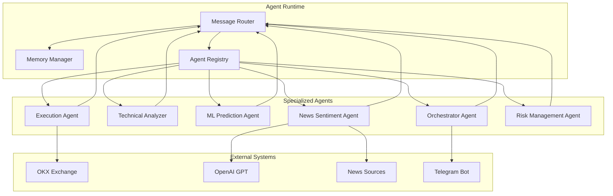
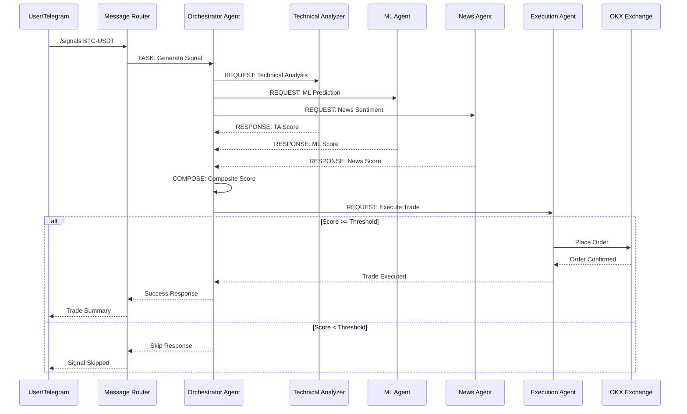
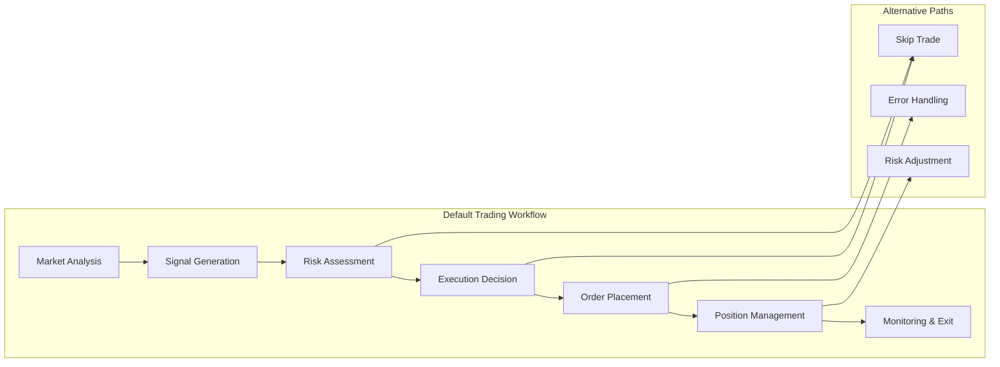
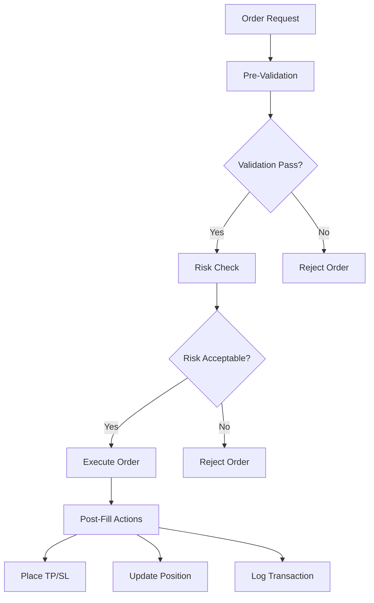
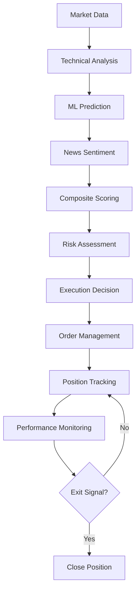

# AiBotBS Architecture Guide

> **Clean Architecture implementation with multi-agent runtime system for AI-powered trading**

## 🏗️ Architecture Overview

AiBotBS follows Clean Architecture principles as defined by Robert C. Martin, ensuring separation of concerns, dependency inversion, and testability. The system is built around a multi-agent runtime that orchestrates trading decisions through specialized agents.

## 🎯 Clean Architecture Layers

### 1. **Presentation Layer** (Outermost)
**Purpose**: Handle user interactions and external communication

**Components**:
- **Telegram Bot**: Real-time trading commands and notifications
- **CLI Interface**: Command-line system management
- **HTTP API**: RESTful endpoints for external integrations
- **Web Dashboard**: Real-time monitoring interface (planned)

**Responsibilities**:
- User input validation
- Response formatting
- Authentication and authorization
- Rate limiting and throttling

### 2. **Application Layer**
**Purpose**: Orchestrate use cases and coordinate domain objects

**Components**:
- **ScoringService**: Composes TA + ML + News into composite scores
- **RiskService**: Calculates risk penalties and annotates decisions
- **SchedulerService**: Manages automated jobs and maintenance tasks
- **NotificationService**: Handles alerts and user communications

**Responsibilities**:
- Use case orchestration
- Transaction management
- Input/output coordination
- Cross-cutting concerns

### 3. **Domain Layer** (Core)
**Purpose**: Contains business logic and enterprise rules

**Components**:
- **Agent System**: Multi-agent orchestration and communication
- **Message Protocol**: Asynchronous message routing and handling
- **Task Graphs**: Configurable workflow definitions
- **Policy Engine**: Business rule evaluation and enforcement

**Responsibilities**:
- Business logic implementation
- Domain model definition
- Business rule validation
- Core algorithm implementation

### 4. **Infrastructure Layer** (Innermost)
**Purpose**: Handle external concerns and technical details

**Components**:
- **OKX CCXT Adapter**: Exchange integration and execution
- **Logging System**: Structured logging with YAML configuration
- **Metrics System**: Prometheus metrics and observability
- **Persistence Layer**: State management and data storage

**Responsibilities**:
- External API integration
- Data persistence
- Logging and monitoring
- Configuration management

## 🔄 Dependency Flow

```
┌─────────────────────────────────────────────────────────────┐
│                    Dependencies Flow                        │
└─────────────────────────────────────────────────────────────┘

Presentation Layer
        ↓ (depends on)
Application Layer
        ↓ (depends on)
Domain Layer
        ↓ (depends on)
Infrastructure Layer

┌─────────────────────────────────────────────────────────────┐
│                    Dependency Inversion                    │
└─────────────────────────────────────────────────────────────┘

Domain Layer ←─── Infrastructure Layer (implements interfaces)
     ↑                    ↓
     └─── Application Layer (uses domain interfaces)
```

## 🤖 Multi-Agent Runtime System

### Agent Architecture



### Message Flow



## 🔧 Core Components

### Message Protocol

```python
@dataclass
class Message:
    id: str
    type: MessageType
    from_agent: str
    to_agent: str
    subject: str
    content: Dict[str, Any]
    timestamp: datetime
    priority: Priority = Priority.NORMAL
    correlation_id: Optional[str] = None
```

**Message Types**:
- `TASK`: Request for action
- `RESPONSE`: Response to request
- `EVENT`: System event notification
- `HEARTBEAT`: Health check message

### Task Graph System



### Policy Engine

```yaml
# configs/policy.yaml
trading:
  risk:
    max_position_size: 0.1  # 10% of portfolio
    max_daily_loss: 0.05    # 5% daily loss limit
    correlation_limit: 0.7   # Max correlation between positions
  
  execution:
    min_score_threshold: 0.7
    max_slippage: 0.002     # 0.2% max slippage
    retry_attempts: 3
    
  scoring:
    ta_weight: 0.4
    ml_weight: 0.4
    news_weight: 0.2
```

## 🛡️ Safety Mechanisms

### Execution Safety



### Risk Management

1. **Position Sizing**: Dynamic calculation based on account equity and risk tolerance
2. **Correlation Limits**: Prevent over-concentration in correlated assets
3. **Drawdown Protection**: Automatic position reduction on significant losses
4. **Circuit Breakers**: System shutdown on critical error thresholds

## 📊 Observability

### Logging Architecture

```yaml
# configs/logging.yaml
loggers:
  aibotbs:
    level: INFO
    handlers: [console, file_info, file_error]
  
  aibotbs.agents:
    level: DEBUG
    handlers: [console_debug, file_debug]
  
  aibotbs.execution:
    level: INFO
    handlers: [console, file_info, file_error]
```

### Metrics Collection

```python
# Key metrics tracked
METRICS = {
    'agent_messages_total': 'Total messages processed by agents',
    'orders_created_total': 'Total orders created',
    'latency_seconds': 'Operation latency',
    'ta_compute_seconds': 'Technical analysis computation time',
    'ml_infer_seconds': 'ML inference time',
    'news_fetch_seconds': 'News fetching time'
}
```

## 🔄 Data Flow

### Trading Decision Pipeline



### State Management

```python
class MemoryManager:
    """Manages persistent state across trading sessions"""
    
    def __init__(self):
        self.positions: Dict[str, Position] = {}
        self.orders: Dict[str, Order] = {}
        self.signals: List[Signal] = []
        self.performance: PerformanceMetrics = PerformanceMetrics()
    
    async def persist_state(self):
        """Save current state to persistent storage"""
        pass
    
    async def restore_state(self):
        """Restore state from persistent storage"""
        pass
```

## 🚀 Performance Characteristics

### Latency Targets

- **Agent Response**: < 100ms average
- **Order Execution**: < 500ms typical
- **Signal Generation**: < 1s end-to-end
- **Risk Calculation**: < 50ms

### Throughput

- **Concurrent Agents**: 10+ simultaneous
- **Message Processing**: 1000+ messages/second
- **Order Management**: 100+ orders/minute
- **Data Processing**: 1GB+ market data/hour

### Resource Usage

- **Memory**: < 512MB baseline, < 2GB peak
- **CPU**: < 30% average, < 80% peak
- **Network**: < 1MB/s average, < 10MB/s peak
- **Storage**: < 100MB logs/day, < 1GB data/month

## 🔧 Configuration Management

### Environment Configuration

```bash
# Trading Configuration
OKX_ISPAPER=true          # Paper trading mode
OKX_DRY_RUN=true          # Dry run mode
RISK_MAX_POSITION_SIZE=0.1 # Max 10% per position

# System Configuration
LOG_LEVEL=INFO            # Logging verbosity
METRICS_ENABLED=true      # Enable Prometheus metrics
TELEGRAM_ENABLED=true     # Enable Telegram bot
```

### Dynamic Configuration

```python
class ConfigManager:
    """Manages runtime configuration updates"""
    
    async def update_config(self, key: str, value: Any):
        """Update configuration at runtime"""
        pass
    
    async def get_config(self, key: str) -> Any:
        """Get current configuration value"""
        pass
    
    async def validate_config(self, config: Dict[str, Any]) -> bool:
        """Validate configuration changes"""
        pass
```

## 🔍 Testing Strategy

### Test Pyramid

```
        /\
       /  \     E2E Tests (5%)
      /____\    
     /      \   Integration Tests (15%)
    /________\  
   /          \ Unit Tests (80%)
  /____________\
```

### Test Categories

1. **Unit Tests**: Individual component testing
2. **Integration Tests**: Component interaction testing
3. **E2E Tests**: Full workflow testing
4. **Performance Tests**: Latency and throughput validation
5. **Security Tests**: Authentication and authorization validation

## 🚀 Deployment

### Container Architecture

```yaml
# docker-compose.yml
version: '3.8'
services:
  aibotbs:
    build: .
    environment:
      - OKX_ISPAPER=true
      - LOG_LEVEL=INFO
    volumes:
      - ./configs:/app/configs
      - ./state:/app/state
    ports:
      - "8000:8000"
  
  prometheus:
    image: prom/prometheus
    ports:
      - "9090:9090"
  
  grafana:
    image: grafana/grafana
    ports:
      - "3000:3000"
```

### Scaling Considerations

- **Horizontal Scaling**: Multiple agent instances
- **Load Balancing**: Message distribution across agents
- **State Synchronization**: Shared state management
- **Failover**: Automatic recovery from failures

## 🔮 Future Enhancements

### Planned Features

1. **Web Dashboard**: Real-time monitoring interface
2. **Mobile App**: iOS/Android trading companion
3. **Advanced ML**: Deep learning model integration
4. **Multi-Exchange**: Support for additional exchanges
5. **Social Trading**: Copy trading and leaderboards

### Architecture Evolution

- **Microservices**: Decompose into smaller services
- **Event Sourcing**: Complete audit trail of all decisions
- **CQRS**: Separate read and write models
- **GraphQL**: Flexible API for frontend applications

---

This architecture provides a solid foundation for building a production-ready, AI-powered trading system that can scale with your needs while maintaining code quality and system reliability.
