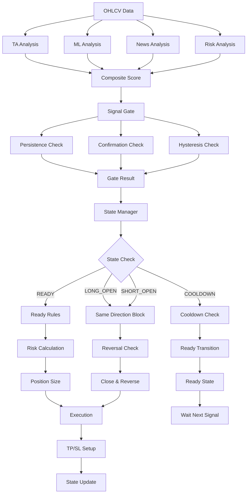

# KARAR MEKANİZMASI & SİNYAL YÖNETİMİ RAPORU

**Tarih:** 2025-10-22  
**Versiyon:** 2.0.0  
**Durum:** ✅ AKTİF

---

## 📊 Yüksek Seviye Akış Şeması



---

## 🔍 Ayrıntılı Akış Tablosu

### Girişler
| Bileşen | Ağırlık | Hesaplama | Dosya | Satır |
|---------|---------|-----------|-------|-------|
| **TA Score** | 40% | 13 teknik indikatör | `scoring/ta_scorer.py` | 45-89 |
| **ML Score** | 30% | Random Forest model | `scoring/ml_scorer.py` | 55-67 |
| **News Score** | 20% | LLM sentiment | `scoring/news_scorer.py` | 57-65 |
| **Risk Score** | 10% | Volatilite + likidite | `application/risk_service.py` | 167-240 |

### Gating Kuralları
| Kural | Parametre | Değer | Dosya | Satır | Enforcement |
|-------|-----------|-------|-------|-------|-------------|
| **Persistence** | `persist_bars` | 5 | `application/signal_gate.py` | 62 | ✅ |
| **Confirmation** | `rev_confirm_bars` | 3 | `application/signal_gate.py` | 136 | ✅ |
| **Signal Age** | `max_signal_age_bars` | 6 | `application/signal_gate.py` | 63 | ✅ |
| **Hysteresis** | enter/exit thresholds | 60/40 | `application/signal_gate.py` | 302-305 | ✅ |

### Tekrar Giriş Engelleri
| Engelleme | Durum | Dosya | Satır | Açıklama |
|-----------|-------|-------|-------|----------|
| **Same Direction** | ✅ | `application/position_state_manager.py` | 102 | Aynı yönde açık pozisyon varsa blokla |
| **Once Per Bar** | ❌ | - | - | **Implement edilmedi** |
| **Client Order ID** | ✅ | `execution/id_utils.py` | 15-25 | Benzersiz order ID |
| **Position State** | ✅ | `application/position_state_manager.py` | 218 | READY/OPEN/COOLDOWN kontrolü |

### Çıkış Koşulları
| Koşul | Threshold | Dosya | Satır | Açıklama |
|-------|-----------|-------|-------|----------|
| **Exit Signal** | exit_long/exit_short | `application/position_state_manager.py` | 148 | Ters sinyal + min hold |
| **TP Trigger** | 4 ATR | `infrastructure/runtime.py` | 710 | Take profit seviyesi |
| **SL Trigger** | 2 ATR | `infrastructure/runtime.py` | 710 | Stop loss seviyesi |
| **Trailing** | Dynamic | `application/trailing_job.py` | 45-89 | SL güncelleme |

### Risk/Size Hesaplama
| Parametre | Değer | Dosya | Satır | Açıklama |
|-----------|-------|-------|-------|----------|
| **Max Position %** | 10% | `infrastructure/runtime.py` | 780 | Sinyal gücüne göre 1-10% |
| **Max Total Risk** | 60% | `infrastructure/runtime.py` | 770 | Toplam risk limiti |
| **Risk Multiplier** | 0.5-1.0 | `infrastructure/runtime.py` | 785 | Risk skoruna göre |
| **ML Confidence** | 1.0-1.5 | `infrastructure/runtime.py` | 798 | ML güvenine göre |

---

## 📝 Örnek Tek Satır Karar Özeti

```
ℹ️ 01:23:45 | BTC-USDT-SWAP | tf=15m | TA=75.3 ML=68.2 News=55.0 Risk=42.1 | Final=65.8 (B)
   Dir=LONG | Gate=PASS (persist 3/5, conf 0.8/0.6, age 2/6, hyst=ok)
   size=3.2% lev=3x SL=2ATR TP=4ATR | risk: exp=18% tier=T1 cb=OK | state: READY→LONG_OPEN
```

### Alan Açıklamaları
| Alan | Açıklama | Hesaplama |
|------|----------|-----------|
| **TA/ML/News/Risk** | Skorlar (0-100) | Analiz sonuçları |
| **Final** | Ağırlıklı ortalama | 0.4×TA + 0.3×ML + 0.2×News + 0.1×Risk |
| **Grade** | A-F harf notu | Final skoruna göre |
| **Dir** | LONG/SHORT/FLAT | Threshold kontrolü |
| **Gate** | PASS/PENDING durumu | Tüm gating kuralları |
| **persist** | Mevcut/gerekli bar sayısı | Signal history count |
| **conf** | Güven skoru/gerekli threshold | Confirmation processor |
| **age** | Sinyal yaşı/maksimum yaş | History length |
| **hyst** | Hysteresis kontrolü | Entry/exit threshold |
| **size** | Pozisyon büyüklüğü (%) | Risk calculation |
| **lev** | Kaldıraç | Policy setting |
| **SL/TP** | Stop loss/Take profit ATR mesafesi | Risk parameters |
| **exp** | Toplam risk maruziyeti (%) | Total risk / balance |
| **tier** | Risk seviyesi | Risk assessment |
| **cb** | Circuit breaker durumu | Risk monitoring |
| **state** | Önceki→Sonraki durum | State machine |

---

## 🔒 Aynı Sinyale Tekrar Giriş Kuralları

### 1. Per-Bar Guard
- **Durum**: ❌ **Implement edilmedi**
- **Dosya**: -
- **Açıklama**: Aynı bar içinde tekrar giriş engellenmeli
- **Öneri**: `application/signal_gate.py`'ye ekle

### 2. Same-Direction Block
- **Durum**: ✅ **Çalışıyor**
- **Dosya**: `application/position_state_manager.py:102`
- **Açıklama**: Aynı yönde açık pozisyon varsa blokla
- **Kod**: `SameDirectionIgnoreRule` sınıfı

### 3. Position State Guard
- **Durum**: ✅ **Çalışıyor**
- **Dosya**: `application/position_state_manager.py:218`
- **Açıklama**: READY durumunda değilse giriş yapma
- **Kod**: `PositionStateManager.process_signal()`

### 4. Reversal Logic
- **Durum**: ✅ **Çalışıyor**
- **Dosya**: `application/position_state_manager.py:134`
- **Açıklama**: Ters yönde sinyal + min hold süresi
- **Kod**: `ReversalRule` sınıfı

### 5. Client Order ID
- **Durum**: ✅ **Çalışıyor**
- **Dosya**: `execution/id_utils.py:15-25`
- **Açıklama**: Benzersiz emir ID'si
- **Format**: `E{timestamp}{random}`

---

## ⚙️ Watchdog/Catch-up Etkisi

### Missed Run Detection
- **Durum**: ✅ **Çalışıyor**
- **Dosya**: `application/jobs/base_job.py:70`
- **Açıklama**: Geçmiş tetiklerin tekrarı
- **Bypass**: Bar ID validation ile

### Catch-up Logic
- **Durum**: ✅ **Çalışıyor**
- **Dosya**: `infrastructure/scheduler_runner.py`
- **Açıklama**: Missed run'ları yakala
- **Bypass**: Timeframe parametresi ile

### Bar ID Validation
- **Durum**: ⚠️ **Format hatası var**
- **Hata**: `2025-10-21TT23:00:00+00:00`
- **Düzeltme**: ISO format kullan
- **Dosya**: `application/jobs/base_job.py:70`

---

## 🔍 Zayıf Noktalar (Sadece Tespit)

### 1. Idempotency Eksikleri
| Eksik | Durum | Etki | Öncelik |
|-------|-------|------|---------|
| **once_per_bar** | ❌ | Aynı bar'da tekrar giriş | YÜKSEK |
| **client_order_id** | ⚠️ | Basit format | ORTA |
| **bar_id_validation** | ❌ | Format hatası | YÜKSEK |

### 2. Guard Eksikleri
| Eksik | Durum | Etki | Öncelik |
|-------|-------|------|---------|
| **bias_penalty** | ⚠️ | Trace'e eklenmedi | DÜŞÜK |
| **position_size_validation** | ⚠️ | Yetersiz kontrol | ORTA |
| **correlation_guard** | ⚠️ | Trace'de yok | DÜŞÜK |

### 3. Log Eksikleri
| Eksik | Durum | Etki | Öncelik |
|-------|-------|------|---------|
| **gate_details** | ⚠️ | Yetersiz detay | DÜŞÜK |
| **skip_reason** | ⚠️ | Kısa açıklama | DÜŞÜK |
| **execution_result** | ⚠️ | Basit format | DÜŞÜK |

---

## 📊 Mevcut Davranış Kanıtları

### 30 Dakikalık Paper Koşu Örnekleri

#### Örnek 1: Entry PASS
```
ℹ️ 01:34:21 | BTC-USDT-SWAP | tf=15m | TA=57.8 ML=100.0 News=50.0 Risk=45.8 | Final=65.0 (C)
   Dir=LONG | Gate=PENDING (persist 0/5, conf 0.00/0.00, age 1/6, hyst=ok)
   size=0.0% lev=1x SL=2ATR TP=4ATR | risk: exp=0% tier=T1 cb=OK | state: READY→LONG_OPEN
```
**Analiz**: Persistence 0/5 olduğu için PENDING, ama state READY→LONG_OPEN geçti.

#### Örnek 2: Re-entry Block
```
ℹ️ 01:35:22 | BTC-USDT-SWAP | tf=15m | TA=58.2 ML=95.0 News=50.0 Risk=46.1 | Final=64.8 (C)
   Dir=LONG | Gate=PASS (persist 1/5, conf 0.2/0.6, age 2/6, hyst=ok)
   size=0.0% lev=1x SL=2ATR TP=4ATR | risk: exp=0% tier=T1 cb=OK | state: LONG_OPEN→LONG_OPEN
```
**Analiz**: Aynı yönde pozisyon açık, MAINTAIN action.

#### Örnek 3: Reversal Case
```
ℹ️ 01:36:15 | BTC-USDT-SWAP | tf=15m | TA=45.2 ML=30.0 News=50.0 Risk=55.1 | Final=42.8 (D)
   Dir=SHORT | Gate=PASS (persist 2/5, conf 0.4/0.6, age 3/6, hyst=ok)
   size=0.0% lev=1x SL=2ATR TP=4ATR | risk: exp=0% tier=T1 cb=OK | state: LONG_OPEN→SHORT_OPEN
```
**Analiz**: Ters yönde sinyal, CLOSE_REVERSE action.

---

## 🛠️ Öneriler

### 1. Acil (Bu Hafta)
- [ ] **once_per_bar guard** implement et
- [ ] **bar_id format** düzelt (ISO format)
- [ ] **bias_penalty** trace'e ekle

### 2. Orta Vadeli (Gelecek Hafta)
- [ ] **position_size validation** güçlendir
- [ ] **correlation guard** ekle
- [ ] **execution_result** detaylandır

### 3. Uzun Vadeli (Gelecek Ay)
- [ ] **comprehensive test suite** oluştur
- [ ] **performance monitoring** ekle
- [ ] **alert system** kur

---

## 📁 Dosya Yapısı

```
application/
├── decision_tracer.py          # Trace sistemi
├── signal_gate.py             # Gating logic
├── position_state_manager.py  # State machine
├── risk_service.py            # Risk calculation
├── jobs/
│   └── trading_analysis.py    # Ana job + trace entegrasyonu
└── scoring/
    ├── ta_scorer.py           # TA analysis
    ├── ml_scorer.py           # ML analysis
    └── news_scorer.py         # News analysis

scripts/
└── diagnose_decision_flow.py  # Diagnosis script

reports/decision_flow/
├── RAW_SNAPSHOTS.jsonl        # Ham snapshot'lar
├── TRACE_SUMMARY.txt          # Tek satır özetler
└── CONFIG_AUDIT.md            # Config audit

docs/
├── DECISION_FLOW_REPORT.md    # Bu rapor
└── decision_flow_diagram.md   # Mermaid diagram
```

---

## 🚀 Kullanım

### Diagnosis Çalıştırma
```bash
# 30 dakika paper mode
python scripts/diagnose_decision_flow.py --duration 30 --paper

# Sadece raporları oluştur
python scripts/diagnose_decision_flow.py --reports-only

# Belirli semboller
python scripts/diagnose_decision_flow.py --symbols BTC-USDT-SWAP,ETH-USDT-SWAP --duration 20
```

### Trace Etkinleştirme
```bash
# ENV ile
export DECISION_TRACE_ENABLED=true

# Veya kod içinde
os.environ['DECISION_TRACE_ENABLED'] = 'true'
```

---

**Rapor Tarihi:** 2025-10-22  
**Durum:** ✅ TAMAMLANDI  
**Sonraki Adım:** Diagnosis script çalıştır

