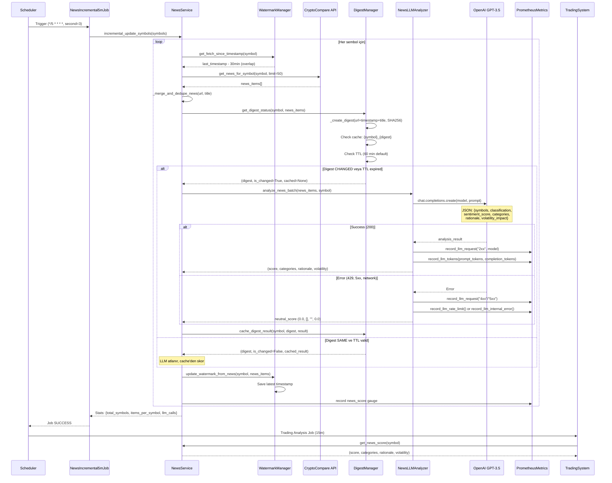

# News Pipeline Genel Bakış
**Oluşturma Tarihi:** 2025-10-21  
**Durum:** Aktif  
**Versiyon:** 2.0

## 1. Yüksek Seviye Özet

News pipeline, kripto para haberleri toplayarak (CryptoCompare API), tekrarlıları temizleyerek (dedup), içerik değişikliklerini tespit ederek (digest hash), LLM tabanlı sentiment analizi yaparak (OpenAI GPT-3.5) ve sonuçları skora dönüştürerek trading kararlarına input sağlayan otomatik sistemdir. Pipeline 5 dakikada bir artımlı güncellemelerle çalışır, watermark sistemiyle yeni haberleri takip eder, digest cache'iyle maliyet optimize edilir ve Prometheus metrikleriyle izlenir.

## 2. Dosya/Dizin Haritası

### Ana Servis Modülleri
- **`application/news_service.py`** (229 satır)
  - Ana news servisi koordinatörü
  - Watermark, digest ve LLM analyzer'ı yönetir
  - Incremental fetch ve bootstrap logic
  - `NewsService.__init__()` - L21-47
  - `NewsService.incremental_update_symbols()` - L167
  - `NewsService._analyze_news_with_llm()` - L246

- **`application/news_digest_manager.py`** (207 satır)
  - Digest-based caching için hash yönetimi
  - TTL tabanlı cache invalidation
  - `NewsDigestManager._create_digest()` - L50-69 (SHA256 hash)
  - `NewsDigestManager.get_digest_status()` - L94-132
  - Cache key formatı: `{symbol}_{digest_hash}`

- **`application/news_watermark_manager.py`** (141 satır)
  - Sembol başına son işlenen timestamp'i tutar
  - Incremental fetch için başlangıç noktası
  - `NewsWatermarkManager.get_fetch_since_timestamp()` - L72-79
  - `NewsWatermarkManager.update_watermark_from_news()` - L81-104

- **`application/news_llm_analyzer.py`** (320+ satır)
  - LLM (OpenAI) entegrasyonu
  - Sentiment analizi ve symbol classification
  - `NewsLLMAnalyzer.analyze_news_batch()` - L29-64
  - `NewsLLMAnalyzer._get_llm_analysis()` - L136-230
  - Diagnostic logging ve Prometheus metrics entegrasyonu
  - L167-227: Detaylı hata/başarı logging

### Adaptörler
- **`adapters/news_apis.py`** (170 satır)
  - `CryptoCompareNewsAPI` - Ücretsiz API wrapper
  - `MultiSourceNewsClient` - Multi-source orchestrator (şu an sadece CryptoCompare)
  - `get_news_for_symbol()` - L51-75, L155-167
  - Persistent aiohttp session yönetimi - L144-153

### Job & Scheduler
- **`application/jobs/news_incremental_5m.py`** (55 satır)
  - 5 dakikalık incremental update job
  - `NewsIncremental5mJob.execute()` - L25-54
  - Bootstrap on-start: `ensure_bootstrap_on_start()` çağrısı - L43

- **`infrastructure/scheduler_runner.py`**
  - News job kaydı - L185-194
  - Schedule: `*/5 * * * *` (her 5 dakika)
  - Offset: `second=3` (5m boundary alignment)
  - Job initialization - L145

- **`application/jobs/run_watchdog.py`**
  - Missed run detection ve catch-up logic
  - Run history tracking

### Scoring & Downstream
- **`scoring/news_scorer.py`** (94 satır)
  - News service'den skor alır
  - `NewsScorer.score()` - L64-94
  - Symbol-specific, mixed, general classification weights

### Storage Paths (from policy.yaml)
```
data/news_watermarks.json     - Watermark state
data/news_llm_digest.json      - Digest cache
data/news_storage.json         - News items store
```

## 3. Akış Diyagramı



## 4. Zamanlama & Tetikleyiciler

### News Incremental Job
- **Schedule:** `*/5 * * * *` (Her 5 dakika)
- **Offset:** `second=3` (5 dakikalık boundary'ye align, scheduler collision önleme)
- **Job ID:** `news_incremental_5m`
- **Registered:** `infrastructure/scheduler_runner.py:185-194`
- **Executor:** `application/jobs/news_incremental_5m.py:25-54`

### Bootstrap Davranışı
- **Trigger:** İlk çalıştırma veya watermark yoksa
- **Logic:** `ensure_bootstrap_on_start()` - `news_incremental_5m.py:43`
- **Lookback:** 24 saat (policy.yaml: `lookback_hours_bootstrap: 24`)
- **Behavior:** Tüm semboller için ilk veri seti toplanır

### Watchdog Catch-up
- **Job:** `run_watchdog.py`
- **Detection:** Missed run timestamp karşılaştırma
- **Action:** Geçmiş run'ları catch-up etme (watermark'tan itibaren)
- **Grace Time:** `misfire_grace_time: 300` saniye (policy.yaml)

### Trading Analysis Integration
- **Schedule:** `*/15 * * * *` (Her 15 dakika)
- **Offset:** `second=7`
- **Calls:** `news_service.get_news_score(symbol)`
- **Uses:** Son LLM analiz sonucu veya cache'den

## 5. ENV & Konfig Tablosu

| ENV Değişkeni | Açıklama | Varsayılan | Olası Değerler | Etki (Maliyet/Performans) |
|--------------|----------|-----------|---------------|---------------------------|
| `NEWS_VERBOSITY` | Haber log detay seviyesi | `summary` | `summary`, `full` | `full`: Her haber detayı loglanır (+disk I/O) |
| `LLM_VERBOSITY` | LLM log detay seviyesi | `summary` | `summary`, `full` | `full`: Her LLM çağrısı detaylı (+disk I/O) |
| `OPENAI_API_KEY` | OpenAI API anahtarı | - (zorunlu) | sk-... | API erişimi için gerekli |
| `OPENAI_MODEL` | LLM model | `gpt-3.5-turbo` | `gpt-3.5-turbo`, `gpt-4` | `gpt-4`: 10x maliyet artışı |

### Policy.yaml Konfigürasyonu

```yaml
news:
  lookback_hours_bootstrap: 24           # İlk veri toplama süresi
  poll_interval_sec: 300                 # Deprecated (scheduler kullanıyor)
  overlap_minutes: 30                    # Watermark overlap (kayıp önleme)
  dedupe:
    key_fields: ["url", "title"]         # Dedup için alanlar
  storage_paths:
    watermarks: "data/news_watermarks.json"
    digests: "data/news_llm_digest.json"
    news_store: "data/news_storage.json"

news_llm:
  enabled: true                          # LLM analizi aktif/pasif
  digest:
    max_items_per_symbol: 30             # Digest'e dahil max haber
  cache:
    ttl_minutes: 60                      # Cache geçerlilik süresi
    invalidate_on_digest_change: true    # Digest değişince temizle

news_scoring:
  thresholds:
    specific: 0.70                       # Symbol-specific eşik
    mixed: 0.30                          # Mixed news eşik
  weights:
    symbol_specific: 1.0                 # Spesifik haber ağırlığı
    mixed_shared: 0.6                    # Karışık haber ağırlığı
    general_market: 0.2                  # Genel piyasa ağırlığı
  majors_bonus: 0.1                      # BTC/ETH için bonus
```

### Maliyet & Performans Etkileri

| Parametre | Düşük Değer | Yüksek Değer | Maliyet Etkisi |
|-----------|-------------|--------------|----------------|
| `max_items_per_symbol` | 10 | 50 | +5x token tüketimi |
| `ttl_minutes` | 30 | 120 | -50% LLM çağrısı (cache hit ↑) |
| `overlap_minutes` | 15 | 60 | +2x API çağrısı (duplicate ↑) |
| Schedule interval | 10m | 3m | +3x API + LLM çağrısı |

**Örnek Token Hesabı:**
- 30 haber × 150 token/haber = 4,500 prompt token
- Yanıt: ~800 completion token
- Toplam: ~5,300 token/analiz
- 10 sembol × 12 çağrı/saat = 120 analiz/saat
- **Saatlik:** ~636,000 token ≈ $0.95
- **Günlük:** ~15M token ≈ $23

## 6. Dedup/Watermark/TTL Mantığı

### Dedup (Tekrar Temizleme)
- **Lokasyon:** `news_service.py:_merge_and_dedupe_news()`
- **Alanlar:** `url`, `title` (policy.yaml'dan)
- **Algoritma:** 
  ```python
  existing_keys = {(item['url'], item['title']) for item in existing}
  new_unique = [item for item in new if (item['url'], item['title']) not in existing_keys]
  ```
- **Lookback:** Mevcut news_data[symbol] listesi (sınırsız, memory-based)

### Watermark (Artımlı Takip)
- **Lokasyon:** `news_watermark_manager.py`
- **Storage:** `data/news_watermarks.json`
- **Format:** `{symbol: "2025-10-21T02:45:00+00:00"}`
- **Overlap:** 30 dakika (policy: `overlap_minutes: 30`)
- **Logic:** 
  ```python
  fetch_since = watermark - timedelta(minutes=30)
  new_news = api.get_news_since(fetch_since)
  watermark = max(news_item['timestamp'])
  ```

### Digest (Cache Key)
- **Lokasyon:** `news_digest_manager.py:_create_digest()`
- **Hash Alanları:** `url`, `timestamp`, `title` (max 30 item)
- **Algoritma:**
  ```python
  1. Sort news by timestamp (newest first)
  2. Take first 30 items
  3. Create dict: [{url, timestamp, title}, ...]
  4. Sort by timestamp (consistency)
  5. SHA256 hash → first 16 chars
  ```
- **Cache Key:** `{symbol}_{digest_hash}` (örn: `BTC_ff63fdde12345678`)
- **Stored:** `{timestamp: "ISO8601", result: {...}, digest: "..."}`

### TTL (Time-To-Live)
- **Süre:** 60 dakika (policy: `ttl_minutes: 60`)
- **Check Logic:**
  ```python
  cached_time = datetime.fromisoformat(entry['timestamp'])
  is_valid = (now - cached_time) < timedelta(minutes=60)
  ```
- **Hit Koşulları:**
  1. Digest aynı (content değişmemiş)
  2. TTL geçerli (60 dakikadan eski değil)
  3. Cache entry exists
- **Invalidation:** TTL expire veya digest change

## 7. LLM Kullanımı

### Model Konfigürasyonu
- **Default Model:** `gpt-3.5-turbo`
- **Lokasyon:** `news_llm_analyzer.py:18`
- **Max Tokens:** 800 (completion)
- **Temperature:** 0.3 (düşük → tutarlı)
- **Timeout:** 30 saniye

### Prompt Formatı (Özet)
```python
f"""
You are a cryptocurrency market analyst. Analyze the following news articles about {symbol}.

Symbol Context:
- Ticker: {symbol}
- Cash Tags: {cashtags}
- Names: {names}

{articles_text}  # Max 10 article, 500 char/body

Respond in JSON format:
{
    "symbols": [{"ticker": "BTC", "name": "Bitcoin", "confidence": 0.92}],
    "classification": "symbol_specific|mixed|general",
    "direction": "positive|negative|neutral",
    "sentiment_score": 0-100,
    "categories": ["MARKET", "TECHNOLOGY", "REGULATION", ...],
    "rationale": "...",
    "volatility_impact": 0.0-1.0
}

Classification Rules:
- symbol_specific: confidence >0.7
- mixed: confidence 0.3-0.7
- general: confidence <0.3
"""
```

### Output Şeması (JSON)
```json
{
  "symbols": [
    {"ticker": "BTC", "name": "Bitcoin", "confidence": 0.92}
  ],
  "classification": "symbol_specific",
  "direction": "positive",
  "sentiment_score": 75.5,
  "categories": ["MARKET", "PARTNERSHIP"],
  "rationale": "Positive news about institutional adoption",
  "volatility_impact": 0.65
}
```

### Early Exit (LLM Atlanır)
1. **Digest HIT:** Aynı digest + TTL geçerli → cache'den dön
2. **LLM Disabled:** `policy.news_llm.enabled: false`
3. **Empty News:** `news_items` boş → neutral score
4. **API Error:** 429/5xx → neutral score + metric

### Token Kullanımı
- **Prompt:** ~4,500-6,000 token (30 haber × 150-200 token)
- **Completion:** ~500-800 token
- **Toplam:** ~5,000-7,000 token/analiz

## 8. Hata Yönetimi & Geri Kazanım

### Retry/Backoff
- **Lokasyon:** `scheduler_runner.py:278-296`
- **Attempts:** 3 (policy: `scheduler.retry.attempts`)
- **Backoff:** [15, 30, 60] saniye (exponential)
- **Logic:**
  ```python
  for attempt in range(3):
      try:
          await job.execute()
          return
      except Exception as e:
          if attempt == 2: raise
          await asyncio.sleep(backoff[attempt])
  ```

### LLM Hata Sınıflandırması
**Lokasyon:** `news_llm_analyzer.py:189-227`

#### 429 Insufficient Quota (OpenAI)
- **Detection:** `http_status == 429` + `error.code == 'insufficient_quota'`
- **Source:** `internal_or_network` (API limit)
- **Action:** 
  - Log: `❌ [LLM] sym={symbol} status=429 insufficient_quota`
  - Metric: `aibot_llm_requests_total{status="4xx"}++`
  - Return: Neutral score
  - **NO automatic retry** (quota issue)

#### 429 Rate Limit (OpenAI)
- **Detection:** `http_status == 429` + `x-ratelimit-*` headers
- **Source:** `openai_rate_limit`
- **Action:**
  - Log: `❌ [LLM] sym={symbol} status=429 rate_limit retry_after={retry_after}`
  - Metric: `aibot_llm_rate_limits_total{source="openai"}++`
  - Return: Neutral score
  - **NO automatic retry** (diagnostic only)

#### 5xx Server Errors
- **Detection:** `http_status >= 500`
- **Source:** OpenAI backend issue
- **Action:**
  - Metric: `aibot_llm_requests_total{status="5xx"}++`
  - Scheduler retry: Backoff [15, 30, 60]s

#### Network/Internal Errors
- **Detection:** Exception without response
- **Source:** `internal_or_network`
- **Action:**
  - Metric: `aibot_llm_internal_errors_total++`
  - Scheduler retry: Backoff [15, 30, 60]s

### Internal Throttle
- **Mevcut Durum:** YOK (şu an throttling yok)
- **Potansiyel:** ENV `LLM_THROTTLE_SEC` ile eklenebilir
- **Alternative:** Digest cache zaten natural throttling sağlıyor

### Circuit Breaker
- **News Pipeline için:** Yok
- **Global Risk Manager:** `application/circuit_breaker.py` (trading için)
- **Koşullar:** Günlük kayıp > threshold

## 9. Gözlenebilirlik

### Prometheus Metrikleri

#### News Metrikleri
```
# Lokasyon: monitoring/prometheus_exporter.py:133-138
aibot_news_score{symbol="BTC"}  # Gauge, 0-100 sentiment score
```

#### LLM Metrikleri
```
# Lokasyon: monitoring/prometheus_exporter.py:304-340

# Request counters
aibot_llm_requests_total{status="2xx"}      # Başarılı istekler
aibot_llm_requests_total{status="4xx"}      # Client errors (429 dahil)
aibot_llm_requests_total{status="5xx"}      # Server errors

# Rate limiting
aibot_llm_rate_limits_total{source="openai"}  # Gerçek OpenAI rate limits

# Internal errors
aibot_llm_internal_errors_total  # Network/internal errors

# Token usage
aibot_llm_request_tokens_sum{model="gpt-3.5-turbo"}   # Toplam prompt tokens
aibot_llm_response_tokens_sum{model="gpt-3.5-turbo"}  # Toplam completion tokens
```

### Log Özet Satırı Formatı

#### News Fetch
```bash
# Console summary (NEWS_VERBOSITY=summary)
📊 [NEWS] sym=BTC incremental: 5 new, 45 total
🔄 [NEWS] Lazy bootstrap for ETH (no watermark)
```

#### LLM Digest Check
```bash
# Console summary
📊 [LLM] sym=BTC digest=CHANGED run=YES items=20
📊 [LLM] sym=ETH digest=SAME run=NO items=15
```

#### LLM Request (Success)
```bash
# Console summary
📊 [LLM] sym=BTC req_id=req_abc123 tokens=4500+650

# File detail (DEBUG)
LLM_SUCCESS | symbol=BTC | request_id=req_abc123 | model=gpt-3.5-turbo | 
prompt_tokens=4500 | completion_tokens=650 | status=200
```

#### LLM Request (Error)
```bash
# Console summary
❌ [LLM] sym=BTC req_id=None status=429 insufficient_quota

# File detail (DEBUG)
LLM_ERROR | symbol=BTC | request_id=None | model=gpt-3.5-turbo | 
http_status=429 | error_source=internal_or_network | error_type=insufficient_quota | 
error_code=insufficient_quota | retry_after=None | 
message=You exceeded your current quota, please check your plan and billing details...
```

#### Job Execution
```bash
[JOB] name=news_incremental_5m status=STARTING
[JOB] name=news_incremental_5m status=SUCCESS dur=2.15s
```

### Grep Kalıpları

```bash
# Haber güncellemeleri
grep "\[NEWS\]" logs/bot.log | tail -20

# LLM çağrıları
grep "\[LLM\]" logs/bot.log | grep "digest=CHANGED"

# Hatalar
grep "❌ \[LLM\]" logs/bot.log | grep "429"

# Token tüketimi
grep "LLM_SUCCESS" logs/bot.log | awk '{print $10, $12}'

# Job timeline
grep "news_incremental_5m" logs/bot.log | grep "status="
```

## 10. Hızlı Çalıştırma/Test Rehberi

### PowerShell (Windows)
```powershell
# Development environment
. .\scripts\dev.ps1

# Scheduler ile (production-like)
$env:NEWS_VERBOSITY="full"
$env:LLM_VERBOSITY="full"
python main.py scheduler

# Tek job test (direct)
python -c "
import asyncio
from application.jobs.news_incremental_5m import NewsIncremental5mJob
from configs.policy import load_policy

async def test():
    policy = load_policy('configs/policy.yaml')
    semaphore = asyncio.Semaphore(1)
    job = NewsIncremental5mJob(policy, semaphore, {})
    await job.initialize()
    await job.execute()

asyncio.run(test())
"
```

### Bash (Linux/WSL)
```bash
# Development environment
source scripts/dev.sh

# Scheduler ile
export NEWS_VERBOSITY="full"
export LLM_VERBOSITY="full"
python main.py scheduler

# Log monitoring
tail -f logs/bot.log | grep -E "\[NEWS\]|\[LLM\]"
```

### Örnek ENV Setleri

#### Minimal (Maliyet Optimizasyonu)
```bash
NEWS_VERBOSITY=summary
LLM_VERBOSITY=summary
# policy.yaml: max_items_per_symbol: 15
# policy.yaml: ttl_minutes: 120
```

#### Debug (Tam Detay)
```bash
NEWS_VERBOSITY=full
LLM_VERBOSITY=full
LOG_LEVEL=DEBUG
# policy.yaml: max_items_per_symbol: 30
# policy.yaml: ttl_minutes: 30
```

#### Production (Balanced)
```bash
NEWS_VERBOSITY=summary
LLM_VERBOSITY=summary
LOG_LEVEL=INFO
# policy.yaml: max_items_per_symbol: 20
# policy.yaml: ttl_minutes: 60
```

### Beklenen Log/Metrik Örnekleri

#### Başarılı Run (5 dakika)
```
02:30:03 | [JOB] name=news_incremental_5m status=STARTING
02:30:03 | 📊 [NEWS] sym=BTC incremental: 3 new, 42 total
02:30:03 | 📊 [LLM] sym=BTC digest=CHANGED run=YES items=20
02:30:05 | 📊 [LLM] sym=BTC req_id=req_xyz tokens=4200+580
02:30:05 | 📊 [NEWS] sym=ETH incremental: 1 new, 38 total
02:30:05 | 📊 [LLM] sym=ETH digest=SAME run=NO items=15
02:30:06 | [JOB] name=news_incremental_5m status=SUCCESS dur=3.12s
```

#### Prometheus Metrics Snapshot
```
aibot_news_score{symbol="BTC"} 72.5
aibot_llm_requests_total{status="2xx"} 145
aibot_llm_requests_total{status="4xx"} 8
aibot_llm_rate_limits_total{source="openai"} 0
aibot_llm_request_tokens_sum{model="gpt-3.5-turbo"} 582000
aibot_llm_response_tokens_sum{model="gpt-3.5-turbo"} 78400
```

## 11. Sık Sorunlar & Çözüm Rehberi

### "Digest değişmiyor, LLM çalışmıyor"
**Sebep:** Yeni haber yok veya aynı haberler
**Çözüm:**
```bash
# 1. Watermark kontrolü
cat data/news_watermarks.json

# 2. Manuel watermark clear (force bootstrap)
python -c "
from application.news_watermark_manager import NewsWatermarkManager
wm = NewsWatermarkManager()
wm.clear_watermark('BTC')
"

# 3. Digest cache temizle
rm data/news_llm_digest.json

# 4. Overlap artır
# policy.yaml: overlap_minutes: 60
```

### "429 görünüyor, quota aşıldı"
**Sebep:** OpenAI API limit veya insufficient quota
**Diagnose:**
```bash
# 1. Log'u incele (gerçek 429 mi?)
grep "LLM_ERROR" logs/bot.log | grep "429" | tail -5

# 2. Metrik kontrolü
curl http://localhost:8000/metrics | grep llm_rate_limits_total

# 3. OpenAI dashboard kontrolü (usage)
```

**Çözüm:**
```bash
# Kısa vadeli: Cache TTL artır
# policy.yaml: ttl_minutes: 120

# Uzun vadeli: Batch azalt
# policy.yaml: max_items_per_symbol: 15

# Schedule interval uzat (5m → 10m)
# policy.yaml: trailing_5m: "*/10 * * * *"
```

### "Çok haber geldi, maliyet arttı"
**Sebep:** Yüksek volume semboller veya market volatility
**Optimize:**
```bash
# 1. Max items azalt
# policy.yaml: max_items_per_symbol: 15  # (30'dan)

# 2. TTL artır (daha az LLM çağrısı)
# policy.yaml: ttl_minutes: 90

# 3. Sembol filtreleme (majors only)
# policy.yaml: exchange.symbols.supported_pairs: ["BTC-USDT-SWAP", "ETH-USDT-SWAP"]

# 4. Sampling ekle (her N run'da bir)
# ENV: NEWS_SAMPLING_EVERY_N_RUNS=2  # Her 2 run'da 1
```

**Token Tasarrufu Hesabı:**
```
Baseline: 30 items × 10 symbols × 12 runs/hour = 3,600 analyses/hour
Optimized: 15 items × 5 symbols × 6 runs/hour = 450 analyses/hour
Tasarruf: 87.5% (-$20/gün)
```

### "Network timeout, LLM çağrısı başarısız"
**Sebep:** OpenAI API yavaş veya network issue
**Çözüm:**
```bash
# 1. Timeout artır
# news_llm_analyzer.py: timeout=60  # (30'dan)

# 2. Retry mekanizması (scheduler)
# policy.yaml: scheduler.retry.attempts: 5

# 3. Alternatif model (daha hızlı)
# ENV: OPENAI_MODEL=gpt-3.5-turbo-16k  # veya gpt-4o-mini
```

### "Watermark ilerlemiyor, eski haberler tekrar geliyor"
**Sebep:** `update_watermark_from_news()` çağrılmıyor veya timestamp parse hatası
**Diagnose:**
```bash
# 1. Son watermark
cat data/news_watermarks.json | jq '.BTC'

# 2. News items timestamp formatı
python -c "
from application.news_service import NewsService
from configs.policy import load_policy
ns = NewsService(load_policy('configs/policy.yaml'))
print(ns.news_data.get('BTC', [])[:3])  # İlk 3 item
"
```

**Çözüm:**
```python
# news_watermark_manager.py:_parse_timestamp() debug
# Timestamp field'ları: publishedAt, published_at, timestamp, time
```

## 12. İyileştirme Önerileri (Opsiyonel)

### 1. GPT-4o-mini Router
**Amaç:** Düşük maliyetli model routing
```python
# news_llm_analyzer.py
def _select_model(self, news_count: int) -> str:
    if news_count <= 10:
        return "gpt-4o-mini"  # Cheap, fast
    elif news_count <= 30:
        return "gpt-3.5-turbo"  # Balanced
    else:
        return "gpt-3.5-turbo-16k"  # Long context

# Maliyet: -40% (gpt-4o-mini 15x ucuz)
```

### 2. Sampling Strategy
**Amaç:** Her run yerine selective çalıştırma
```python
# news_incremental_5m.py
async def execute(self):
    run_count = self.runtime_state.get('news_run_count', 0)
    sample_rate = int(os.getenv('NEWS_SAMPLING_EVERY_N_RUNS', '1'))
    
    if run_count % sample_rate != 0:
        logger.info(f"⏭️ Skipping run {run_count} (sample rate: {sample_rate})")
        return
    
    # Normal execution...
```

### 3. Budget Guard
**Amaç:** Günlük LLM token limiti
```python
# news_llm_analyzer.py
class NewsLLMAnalyzer:
    def __init__(self, ...):
        self.daily_token_limit = int(os.getenv('LLM_DAILY_TOKEN_LIMIT', '1000000'))
        self.daily_token_count = 0
        self.last_reset = datetime.now(timezone.utc).date()
    
    async def _get_llm_analysis(self, ...):
        if self._check_budget_exceeded():
            logger.warning("💰 Daily LLM budget exceeded, using cache only")
            raise BudgetExceededException()
        
        # Normal LLM call...
        self.daily_token_count += (prompt_tokens + completion_tokens)
```

### 4. Structured Output (JSON Mode)
**Amaç:** GPT-3.5-turbo JSON mode kullanımı (daha güvenilir parse)
```python
response = await self.client.chat.completions.create(
    model="gpt-3.5-turbo-1106",  # JSON mode destekleyen
    messages=[...],
    response_format={"type": "json_object"},  # Force JSON
    ...
)
```

### 5. Cache TTL Tuning (Adaptive)
**Amaç:** Volatility'ye göre dinamik TTL
```python
# news_digest_manager.py
def _get_adaptive_ttl(self, symbol: str, market_volatility: float) -> int:
    base_ttl = 60
    if market_volatility > 0.8:  # High volatility
        return base_ttl // 2  # 30 min (daha sık güncelle)
    elif market_volatility < 0.3:  # Low volatility
        return base_ttl * 2  # 120 min (az güncelle)
    return base_ttl
```

### 6. Multi-source Aggregation
**Amaç:** CryptoCompare + CoinDesk + Twitter (gelecek)
```python
# adapters/news_apis.py
class MultiSourceNewsClient:
    async def get_news_for_symbol(self, symbol: str):
        cc_news = await self.cryptocompare.get_news(symbol)
        # coindesk_news = await self.coindesk.get_news(symbol)
        # twitter_news = await self.twitter.get_tweets(symbol)
        
        return self._dedupe_and_rank([cc_news, ...])
```

### 7. Sentiment Confidence Threshold
**Amaç:** Düşük confidence'lı sonuçları skipla
```python
# news_service.py
async def _analyze_news_with_llm(self, ...):
    result = await self.llm_analyzer.analyze_news_batch(...)
    
    if result['confidence'] < 0.6:  # Low confidence
        logger.warning(f"⚠️ Low confidence analysis for {symbol}, using neutral")
        return self._neutral_score()
    
    return result
```

---

**Doküman Versiyonu:** 1.0  
**Son Güncelleme:** 2025-10-21  
**Durum:** ✅ Tamamlandı  
**Katkıda Bulunanlar:** AI Analysis Team


