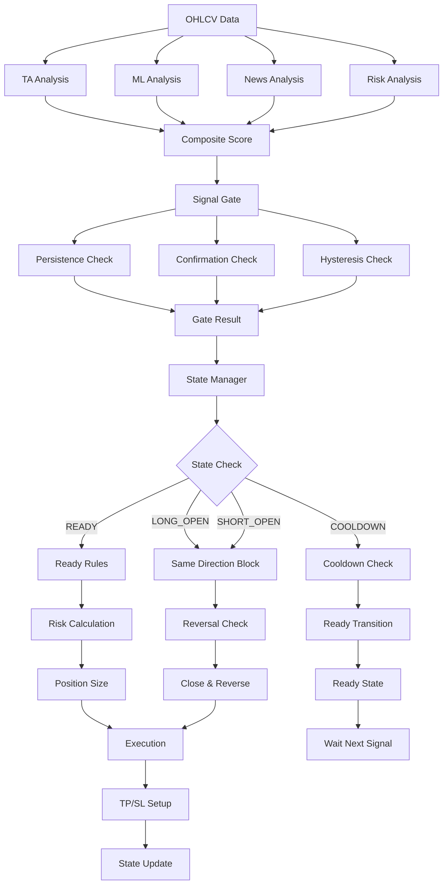

# Karar Akışı Diyagramı

## Detaylı Akış

### 1. Veri Toplama
- **OHLCV Data**: 200 bar (5m, 15m, 1h)
- **News Data**: LLM analizi
- **Market Data**: Ticker, balance, positions

### 2. Analiz Aşaması
- **TA Analysis**: 13 teknik indikatör
- **ML Analysis**: Random Forest model
- **News Analysis**: LLM sentiment
- **Risk Analysis**: Volatilite + likidite

### 3. Composite Score
- **Ağırlıklar**: TA(40%) + ML(30%) + News(20%) + Risk(10%)
- **Bias Service**: Trend, news, volatility guards
- **Grade**: A-F harf notu

### 4. Signal Gating
- **Persistence**: 5 bar süreklilik
- **Confirmation**: 3 bar onay
- **Hysteresis**: Farklı entry/exit threshold'ları
- **Regime**: ADX tabanlı piyasa rejimi

### 5. State Management
- **READY**: Pozisyon yok, giriş bekleniyor
- **LONG_OPEN**: Long pozisyon açık
- **SHORT_OPEN**: Short pozisyon açık
- **COOLDOWN**: Pozisyon kapandı, bekleme süresi

### 6. Risk Calculation
- **Position Size**: Sinyal gücüne göre 1-10%
- **Risk Multiplier**: Risk skoruna göre 0.5-1.0
- **ML Confidence**: ML güvenine göre 1.0-1.5
- **Max Risk**: Toplam %60 limit

### 7. Execution
- **Market Order**: Entry emri
- **TP/SL Setup**: 4 ATR TP, 2 ATR SL
- **Trailing**: SL güncelleme
- **State Update**: Pozisyon durumu güncelleme

### 8. Guards & Blocks
- **Same Direction**: Aynı yönde tekrar giriş engeli
- **Once Per Bar**: Bar bazında tekrar giriş engeli (implement edilmedi)
- **Client Order ID**: Benzersiz emir ID'si
- **Position State**: Durum kontrolü

### 9. Reversal Logic
- **Close & Reverse**: Ters yönde sinyal + min hold süresi
- **Min Hold**: Minimum tutma süresi
- **Cooldown**: Kapanma sonrası bekleme

### 10. Monitoring
- **Prometheus**: Metrikler
- **Logs**: Detaylı loglar
- **Trace**: Karar izleme
- **Alerts**: Risk uyarıları

