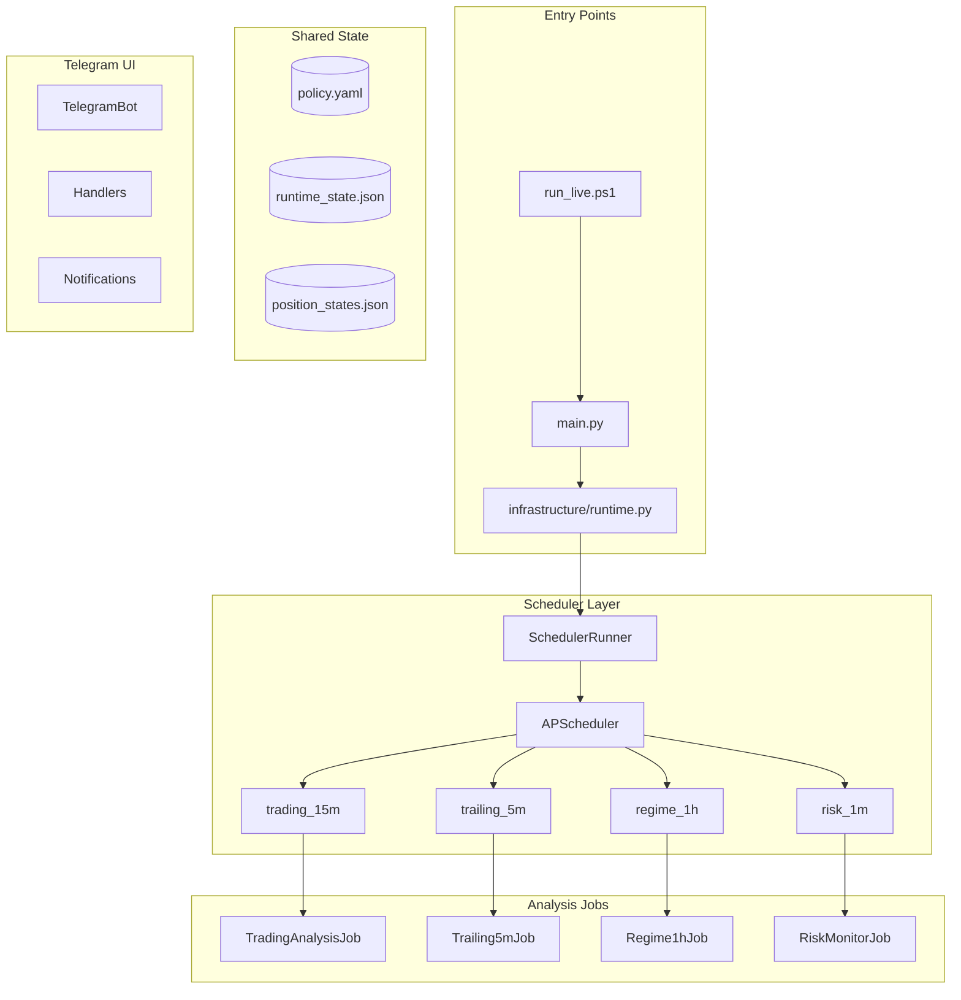
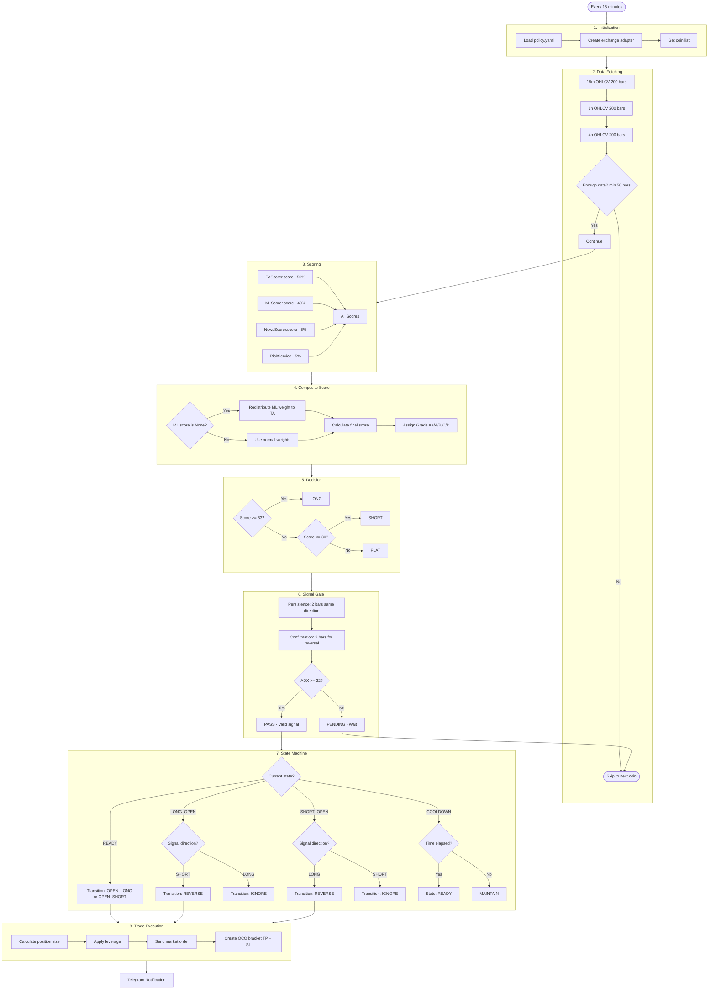
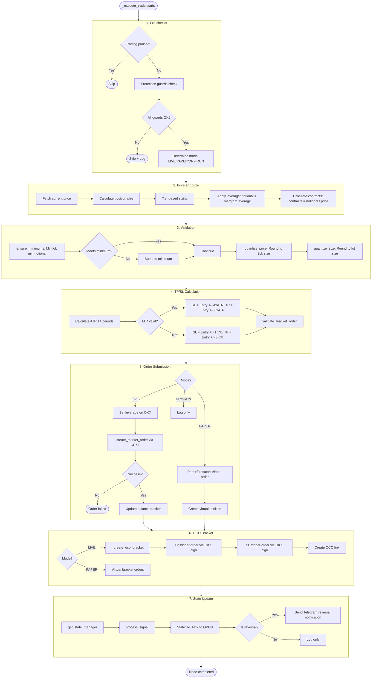
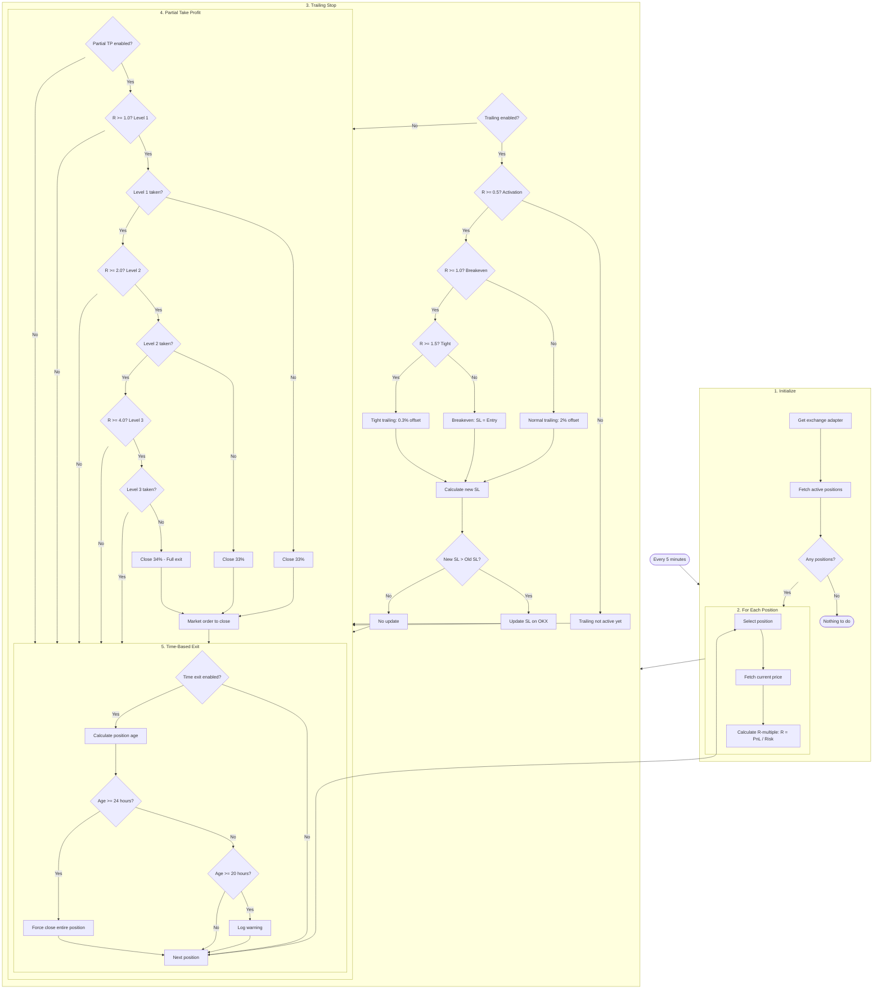
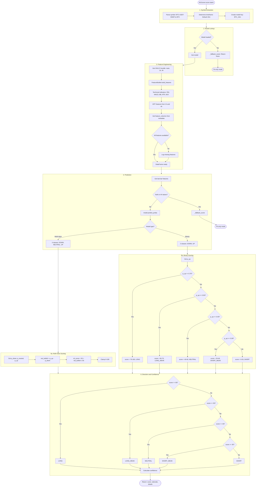
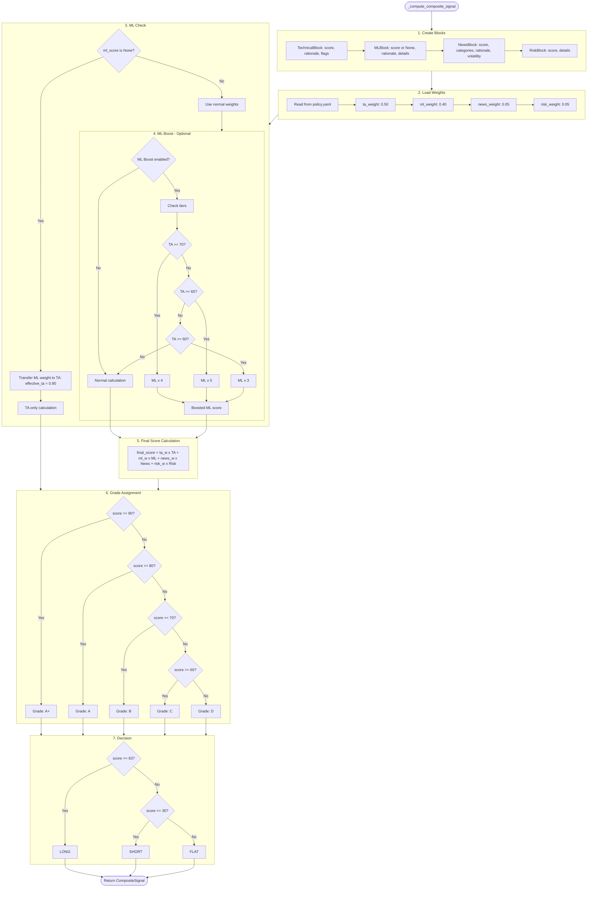
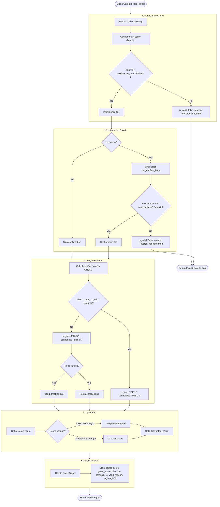

# AI Trade Bot - Detailed Flow Diagrams

> All diagrams use ASCII-only characters for maximum compatibility.

---

## 1. System Architecture Overview



---

## 2. Main Trading Pipeline (15-Minute Cycle)



---

## 3. Trade Execution Detail



---

## 4. Exit Strategies (5-Minute Cycle)



---

## 5. ML Scoring Pipeline



---

## 6. Composite Signal Calculation



---

## 7. Signal Gate Processing



---

## Quick Reference

| Flow            | Trigger         | Main File           | Key Functions                                     |
| --------------- | --------------- | ------------------- | ------------------------------------------------- |
| Main Trading    | _/15 _ \* \* \* | trading_analysis.py | `_process_symbol()`, `_execute_trade()`           |
| Exit Strategy   | _/5 _ \* \* \*  | trailing_5m.py      | `_process_trailing_stop()`, `_check_partial_tp()` |
| ML Scoring      | On-demand       | ml_scorer.py        | `score()`, `_load_all_models()`                   |
| Composite       | On-demand       | runtime.py          | `_compute_composite_signal()`                     |
| Signal Gate     | On-demand       | signal_gate.py      | `process_signal()`                                |
| Order Execution | On-demand       | runtime.py          | `_execute_trade()`, `_create_oco_bracket()`       |

---

## How to View

1. **mermaid.live**: Copy any code block and paste at https://mermaid.live
2. **VS Code**: Install "Markdown Preview Mermaid Support" extension
3. **GitHub**: Push this file - diagrams render automatically
4. **Export to PNG/SVG**:
   ```bash
   npx @mermaid-js/mermaid-cli -i trading_pipeline_flowchart.md -o flowchart.png
   ```
