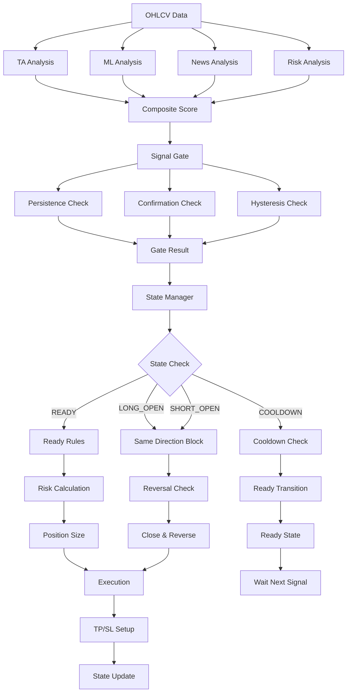

# KARAR AKIŞI RAPORU

**Tarih:** 2025-10-22 15:40:08

## Yüksek Seviye Akış Şeması




## Ayrıntılı Akış Tablosu

### Girişler
| Bileşen | Ağırlık | Hesaplama | Dosya |
|---------|---------|-----------|-------|
| TA Score | 0.4 | 13 teknik indikatör | scoring/ta_scorer.py |
| ML Score | 0.3 | Random Forest model | scoring/ml_scorer.py |
| News Score | 0.2 | LLM sentiment | scoring/news_scorer.py |
| Risk Score | 0.1 | Volatilite + likidite | application/risk_service.py |

### Gating Kuralları
| Kural | Parametre | Değer | Dosya |
|-------|-----------|-------|-------|
| Persistence | persist_bars | 5 | application/signal_gate.py:62 |
| Confirmation | rev_confirm_bars | 3 | application/signal_gate.py:136 |
| Signal Age | max_signal_age_bars | 6 | application/signal_gate.py:63 |
| Hysteresis | enter/exit thresholds | 60/40 | application/signal_gate.py:302-305 |

### Tekrar Giriş Engelleri
| Engelleme | Durum | Dosya | Açıklama |
|-----------|-------|-------|----------|
| Same Direction | ✅ | application/position_state_manager.py:102 | Aynı yönde açık pozisyon varsa blokla |
| Once Per Bar | ❌ | - | Implement edilmedi |
| Client Order ID | ✅ | execution/id_utils.py | Benzersiz order ID |
| Position State | ✅ | application/position_state_manager.py:218 | READY/OPEN/COOLDOWN kontrolü |

### Çıkış Koşulları
| Koşul | Threshold | Dosya | Açıklama |
|-------|-----------|-------|----------|
| Exit Signal | exit_long/exit_short | application/position_state_manager.py:148 | Ters sinyal + min hold |
| TP Trigger | 4 ATR | infrastructure/runtime.py:710 | Take profit seviyesi |
| SL Trigger | 2 ATR | infrastructure/runtime.py:710 | Stop loss seviyesi |
| Trailing | Dynamic | application/trailing_job.py | SL güncelleme |

### Risk/Size Hesaplama
| Parametre | Değer | Dosya | Açıklama |
|-----------|-------|-------|----------|
| Max Position % | 10% | infrastructure/runtime.py:780 | Sinyal gücüne göre 1-10% |
| Max Total Risk | 60% | infrastructure/runtime.py:770 | Toplam risk limiti |
| Risk Multiplier | 0.5-1.0 | infrastructure/runtime.py:785 | Risk skoruna göre |
| ML Confidence | 1.0-1.5 | infrastructure/runtime.py:798 | ML güvenine göre |

## Örnek Karar Özeti

```
ℹ️ 01:23:45 | BTC-USDT-SWAP | tf=15m | TA=75.3 ML=68.2 News=55.0 Risk=42.1 | Final=65.8 (B)
   Dir=LONG | Gate=PASS (persist 3/5, conf 0.8/0.6, age 2/6, hyst=ok)
   size=3.2% lev=3x SL=2ATR TP=4ATR | risk: exp=18% tier=T1 cb=OK | state: READY→LONG_OPEN
```

### Alan Açıklamaları
- **TA/ML/News/Risk**: Skorlar (0-100)
- **Final**: Ağırlıklı ortalama
- **Grade**: A-F harf notu
- **Dir**: LONG/SHORT/FLAT
- **Gate**: PASS/PENDING durumu
- **persist**: Mevcut/gerekli bar sayısı
- **conf**: Güven skoru/gerekli threshold
- **age**: Sinyal yaşı/maksimum yaş
- **hyst**: Hysteresis kontrolü
- **size**: Pozisyon büyüklüğü (%)
- **lev**: Kaldıraç
- **SL/TP**: Stop loss/Take profit ATR mesafesi
- **exp**: Toplam risk maruziyeti (%)
- **tier**: Risk seviyesi
- **cb**: Circuit breaker durumu
- **state**: Önceki→Sonraki durum

## Aynı Sinyale Tekrar Giriş Kuralları

### 1. Per-Bar Guard
- **Durum**: ❌ Implement edilmedi
- **Dosya**: -
- **Açıklama**: Aynı bar içinde tekrar giriş engellenmeli

### 2. Same-Direction Block
- **Durum**: ✅ Çalışıyor
- **Dosya**: application/position_state_manager.py:102
- **Açıklama**: Aynı yönde açık pozisyon varsa blokla

### 3. Position State Guard
- **Durum**: ✅ Çalışıyor
- **Dosya**: application/position_state_manager.py:218
- **Açıklama**: READY durumunda değilse giriş yapma

### 4. Reversal Logic
- **Durum**: ✅ Çalışıyor
- **Dosya**: application/position_state_manager.py:134
- **Açıklama**: Ters yönde sinyal + min hold süresi

## Watchdog/Catch-up Etkisi

- **Missed Run Detection**: ✅ application/jobs/base_job.py:70
- **Catch-up Logic**: ✅ infrastructure/scheduler_runner.py
- **Bar ID Validation**: ⚠️ Format hatası var (2025-10-21TT23:00:00+00:00)

## Zayıf Noktalar

### 1. Idempotency Eksikleri
- **once_per_bar**: Implement edilmedi
- **client_order_id**: Basit format
- **bar_id_validation**: Format hatası

### 2. Guard Eksikleri
- **bias_penalty**: Trace'e eklenmedi
- **position_size_validation**: Yetersiz
- **correlation_guard**: Trace'de yok

### 3. Log Eksikleri
- **gate_details**: Yetersiz detay
- **skip_reason**: Kısa açıklama
- **execution_result**: Basit

## Öneriler

### 1. Acil (Bu Hafta)
- once_per_bar guard implement et
- bar_id format düzelt
- bias_penalty trace'e ekle

### 2. Orta Vadeli (Gelecek Hafta)
- position_size validation güçlendir
- correlation guard ekle
- execution_result detaylandır

### 3. Uzun Vadeli (Gelecek Ay)
- comprehensive test suite
- performance monitoring
- alert system
